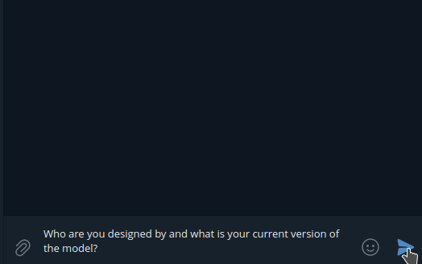
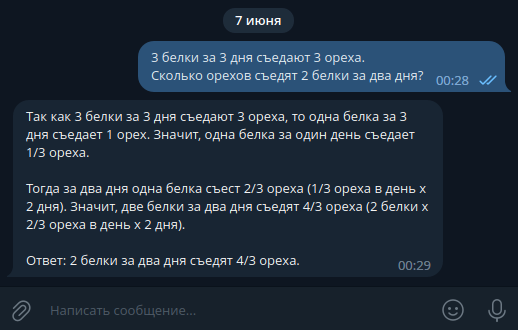

# ChatGPT-simplebot
Telegram bot with basic functionality to provide interactive communication using the OpenAI API.  
Based on the powerful artificial intelligence model, ChatGPT, which is capable of answering a wide range of questions and providing natural and comprehensible interaction.

## Demonstration

 

## Tech stack
- Maven
- Spring Boot

## License
Apache License 2.0 - file [LICENSE](LICENSE) for detailed view